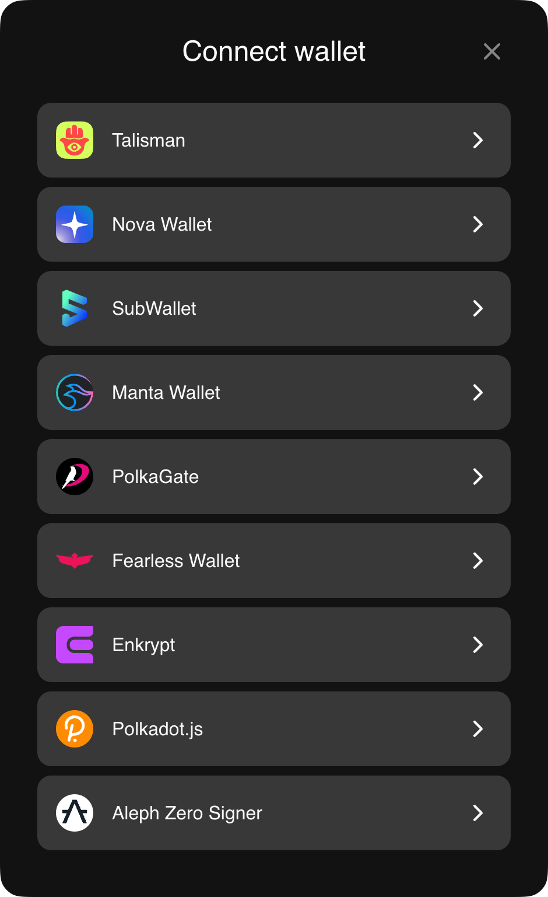

# Talisman Connect


[](https://talismansociety.github.io/talisman-connect)
[](https://discord.gg/talisman)

**Connect your DApp** to Ethereum and Polkadot wallets with Talisman Connect. A minimal SDK to connect your DApp with your users' favourite EOA wallets.

<div align="center">

</div>

## How to use (for DApp developers)

### Quickstart example

1. Add the SDK to your DApp's dependencies:

   ```bash
   # Using npm
   npm install --save @talismn/connect-wallets
   # Using bun
   bun add @talismn/connect-wallets
   # Using pnpm
   pnpm add @talismn/connect-wallets
   # Using yarn
   yarn add @talismn/connect-wallets
   ```

1. Add the code

   ```ts
   import { getWallets } from '@talismn/connect-wallets'

   // get an array of wallets which are installed
   const installedWallets = getWallets().filter((wallet) => wallet.installed)

   // get talisman from the array of installed wallets
   const talismanWallet = installedWallets.find(
     (wallet) => wallet.extensionName === 'talisman',
   )

   // enable the wallet
   if (talismanWallet) {
     talismanWallet.enable('myCoolDapp').then(() => {
       talismanWallet.subscribeAccounts((accounts) => {
         // do anything you want with the accounts provided by the wallet
         console.log('got accounts', accounts)
       })
     })
   }
   ```

### More details

Talisman Connect can be used in one of three ways:

1. `[POPULAR]` Integrate as a standalone library within your own UI.  
   See [@talismn/connect-wallets](https://github.com/TalismanSociety/talisman-connect/tree/main/packages/connect-wallets) for instructions on this option.

1. Integrate using a set of themeable React components.  
   See [@talismn/connect-components](https://github.com/TalismanSociety/talisman-connect/tree/main/packages/connect-components) for instructions on this option.

1. Integrate using our generic ready-to-use modal UI.
   See [@talismn/connect-ui](https://github.com/TalismanSociety/talisman-connect/tree/main/packages/connect-ui) for instructions on this option.

## How to contribute to this repo

1. Clone this repo and install its dependencies.

   ```bash
   git clone git@github.com:TalismanSociety/talisman-connect.git
   cd talisman-connect
   pnpm install
   pnpm build
   ```

1. Run the devserver to preview your changes as you make them.

   ```bash
   pnpm run dev
   ```

1. Make some changes, then commit and push them to a fork on GitHub.
1. Open a pull request and our team will review your changes.
